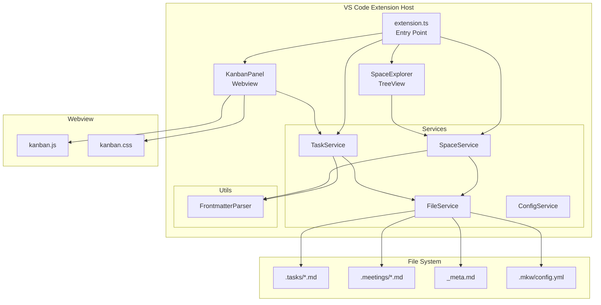
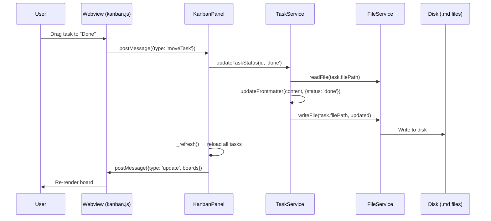

# Architecture Overview

## High-Level Architecture

## Layer Overview

| Layer | Technology | Purpose |
|-------|------------|---------|
| **TreeView** | VS Code TreeDataProvider | Space explorer sidebar |
| **Webview** | Vanilla JS + CSS | Kanban board with drag-and-drop |
| **Services** | TypeScript (interfaces) | Space/Task/File/Config management |
| **Utils** | FrontmatterParser | YAML frontmatter read/write |
| **Persistence** | Markdown + YAML frontmatter | Tasks as `.tasks/*.md` files |

## Data Flow

## Extension Entry Point

The extension activates on `onStartupFinished` and registers:

- **Commands** — 15+ commands for task/space/meeting operations
- **TreeView** — `SpaceExplorer` in the Activity Bar
- **File Watcher** — Scoped to `**/{_meta,.tasks/**,.meetings/**,.mkw/**}.md`
- **Auto-open** — Board opens automatically when the sidebar becomes visible

## Service Interfaces

All services implement interfaces defined in `types.ts` for testability:

- `IFileService` — File I/O abstraction
- `IConfigService` — VS Code configuration wrapper
- `ISpaceService` — Space discovery and management
- `ITaskService` — Task CRUD, status transitions, archival
