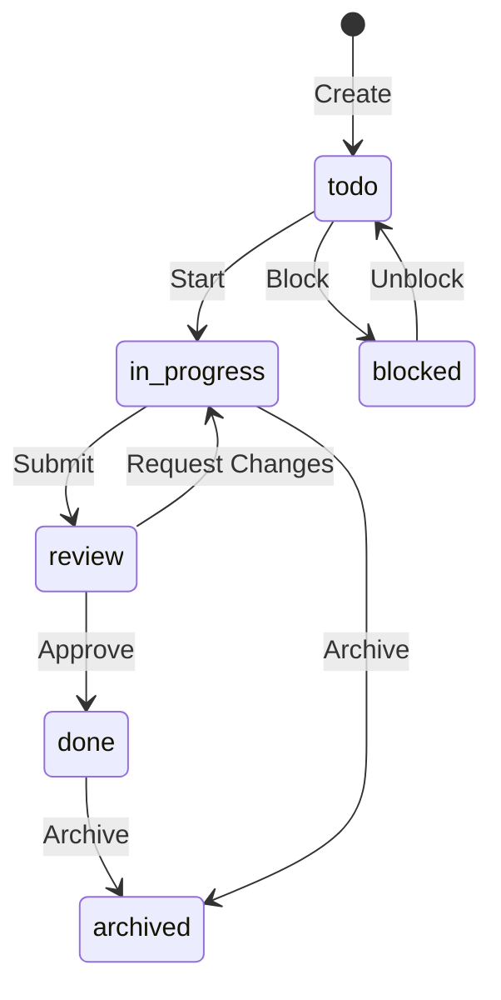

# Tasks & Meetings

## Creating Tasks

### From the Board

Press `C` on the Kanban board or use the quick-add input at the top of any column. Type a title and press ++enter++.

### From the Command Palette

`Koban: New Task` — prompts for space, title, and creates the task file.

### From Code Selection

Select code in the editor → right-click → **"Create Koban Task from Selection"**. The task will include a link back to the source file and line.

## Task Lifecycle



## Task File Format

```markdown
---
id: task-1711234567-a3f2
space: website-relaunch
status: in-progress
priority: high
assignee: Max
due: 2024-04-15
tags: [backend, api]
created: 2024-03-22
---

# API Endpoint Implementation

## Description
Create REST endpoint for user management.

## Checklist
- [x] OpenAPI spec
- [ ] Implementation
- [ ] Tests

## Links
- Related: task-1711234000
```

## Archiving Tasks

Tasks can be archived via:

- Press `A` on the board (with a task selected)
- Right-click → "Archive Task" in the sidebar
- Auto-archive after N days (configure `koban.autoArchiveDays`)

Archived tasks are moved to `.tasks/.archive/` and their status is set to `archived`.

## Meetings

### Creating Meetings

`Koban: New Meeting` — prompts for space, title, and date.

Meetings appear as chips at the top of the Kanban board.

### Meeting File Format

```markdown
---
type: meeting
id: 2024-03-22-sprint-planning
space: website-relaunch
date: 2024-03-22
meeting_type: planning
duration: 60m
participants: [Alice, Bob, Charlie]
---

# Sprint Planning

## Agenda
1. Review backlog
2. Sprint goal
3. Capacity planning

## Notes
...

## Action Items
- [ ] Alice: Update wireframes
- [ ] Bob: Set up staging env

## Decisions
- Sprint length: 2 weeks
```
